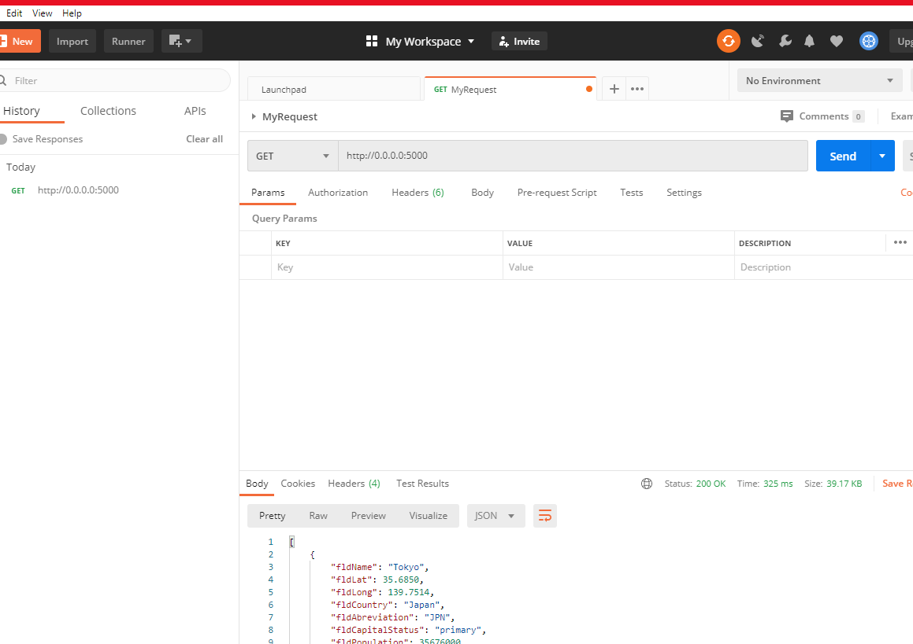
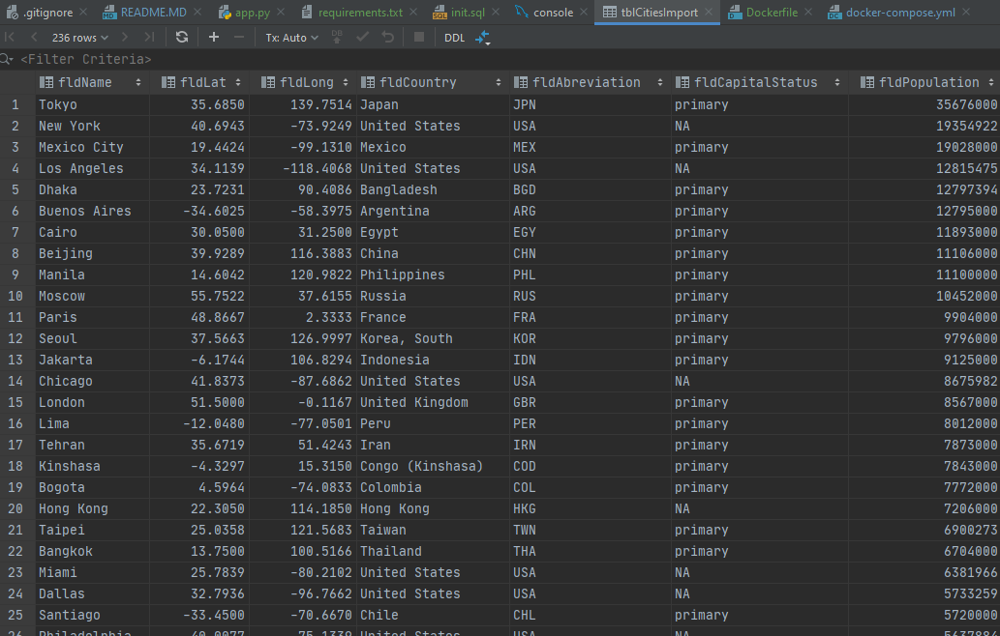

# Project Description
This project is a homework assignment to teach how to get Pycharm setup with Docker, Flask, MySQL, and Postman

## Assignments
* [Assignment 3](formIntro-pycharm.pdf)

## Videos
* [Video 3 - Assignment 3](https://youtu.be/5WBYxNZz8Zw)

## Assignment 3 Readings
* [More about Jinja Flask Templates](https://realpython.com/primer-on-jinja-templating/)
* [Reference for Python MySQL - Note: We Use this with flask and on line 53 you can see how to adapt it to connect to the database connection through flask's single connection to mysql](https://www.w3schools.com/python/python_mysql_getstarted.asp)

## Screenshots below:

### Project Description
This project is a homework assignment to teach how to get Pycharm setup with Docker, Flask, MySQL, and Postman
