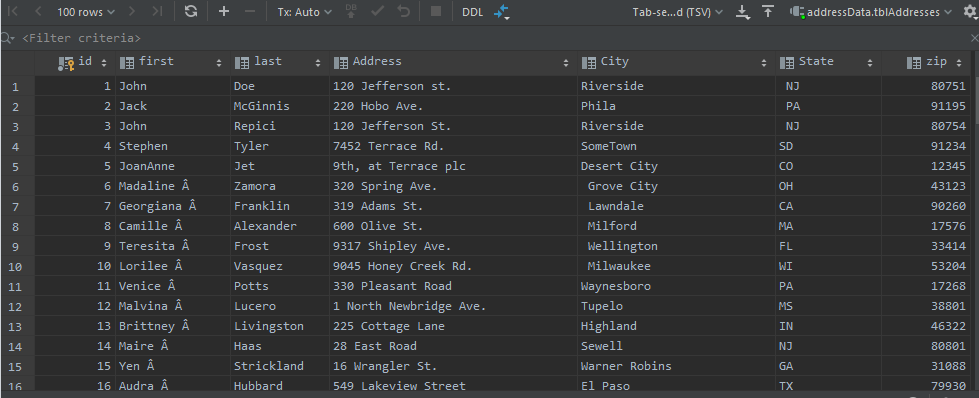
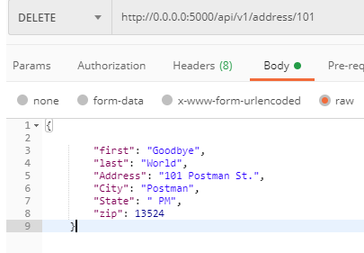
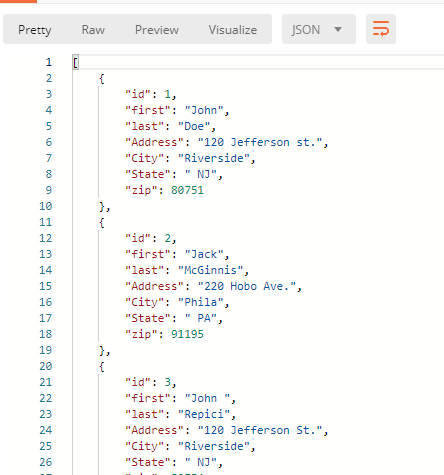
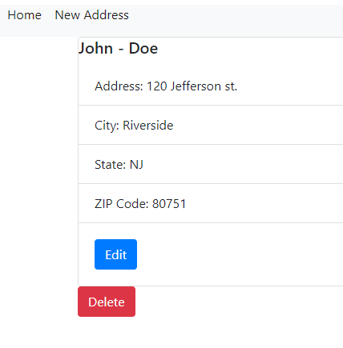

## Screenshots (_also found in the above word documents_):
* database 
* deleted 
* postman 
* get 
* post

### Project Description
This project is a homework assignment to teach how to get Pycharm setup with Docker, Flask, MySQL, and Postman
